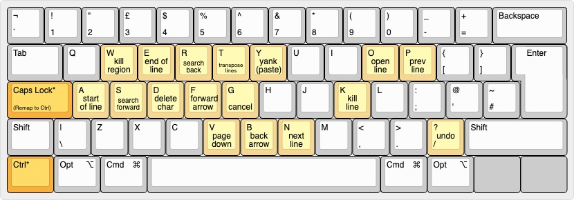
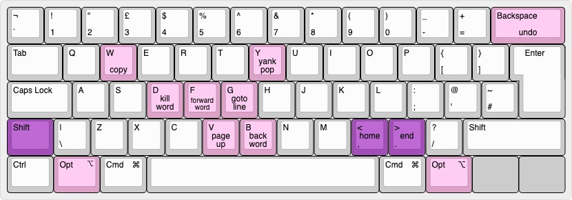
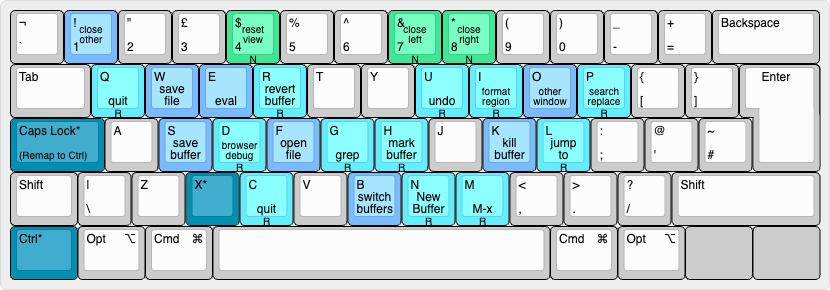
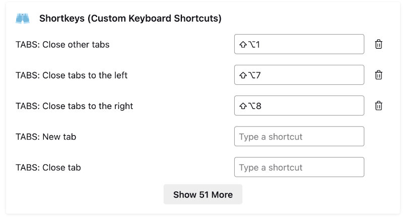
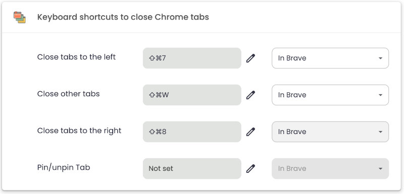

After successfully [configuring Hammerspoon](https://jwtanner.com/posts/emacs-keybindings-to-rule-them-all/) to bring Emacs keybindings to every application on macOS, I decided to port my script to [Karabiner-Elements](https://karabiner-elements.pqrs.org/).

## Why Karabiner?

1. **Speed:** Karabiner is fast even with complex scripts.
2. **Upgrades:** The Karabiner project keeps up to date with new macOS releases.
3. **A Better Tool for the Job:** [Hammerspoon](https://www.hammerspoon.org/) can do much more than key mapping. Karabiner is focused on shortcuts.

## Porting the Configuration

Porting my Hammerspoon script to Karabiner wasn’t a simple copy-paste job. I had to port the code from Lua to Ruby. Before I started, I looked for existing [karabiner configurations](https://ke-complex-modifications.pqrs.org/) with Emacs keybindings. There were a few, but **Emacs keybindings (rev13)** by [tekezo](https://github.com/tekezo) was the closest to what I needed.

The main configuration Karabiner config file starts like this:

```ruby
def main
  puts JSON.pretty_generate(
    "title" => "Universal Emacs Keybindings",
    "maintainers" => ["justintanner"],
    "rules" => [
      "description" => "Emacs Emulation in all apps without emacs keybindings (v1.2)",
      "manipulators" => c_x + control_keys + option_keys
    ]
  )
end
```

This entry point controls the **three** major types of shortcuts: **Ctrl**, **Option** and the chord **Ctrl+x**. 

## Control Keys (ctrl)

These are fundamental Emacs shortcuts for navigation and other basic actions. Most of these shortcuts are already supported in macOS by default and did not need to be remapped.



## Option Keys (option)

Most Option (or Alt) shortcuts are supported by macOS by default. I wanted to provide basic Emacs compatibility for most apps, but I personally do not rely on Option shortcuts as they are harder to reach on the keyboard.



## C-x Chords (with extra shortcuts)

Ctrl+X chords are my favorite. They do not conflict with existing OS shortcuts and there are many un-used chords which can be assigned to new tasks.



* **N:** New shortcut
* **R:** Remapped shortcut

## Tabs

Chrome, Brave and Firefox don’t have native shortcuts for the following tab operations:

1. Close other tabs (C-x/C-1)
2. Close tabs to the right (C-x/C-8)
3. Close tabs to the left (C-x/C-7)

To map these shortcuts correctly, you’ll need some browser plugins/extensions.

* **Firefox**: https://github.com/mikecrittenden/shortkeys
* **Chromium**: https://github.com/diophung/close-chrome-tabs

After installing those extensions we’ll need to configure the shortcuts manually with the following values:





## Conclusion

The move to Karabiner decreased input lag and reduced remapping bugs. If you want to try it yourself:

1. Install [Karabiner-Elements](https://karabiner-elements.pqrs.org/) 
2. Search for “Universal” on [karabiner configurations](https://ke-complex-modifications.pqrs.org/)  and enable the latest version (1.2)

